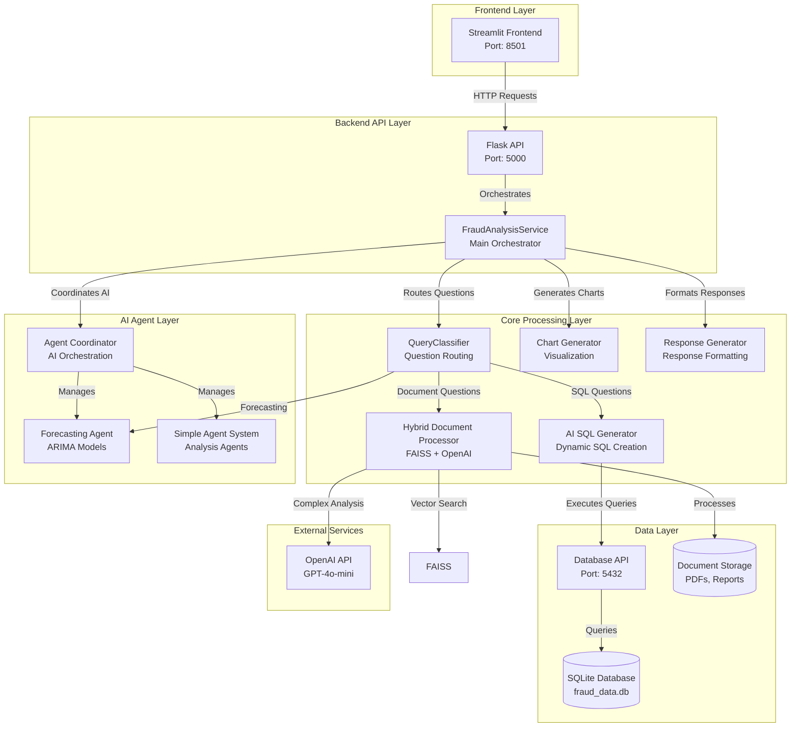
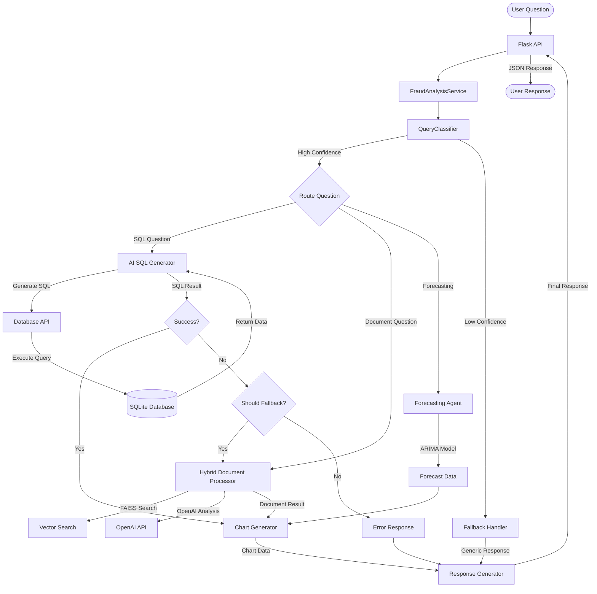
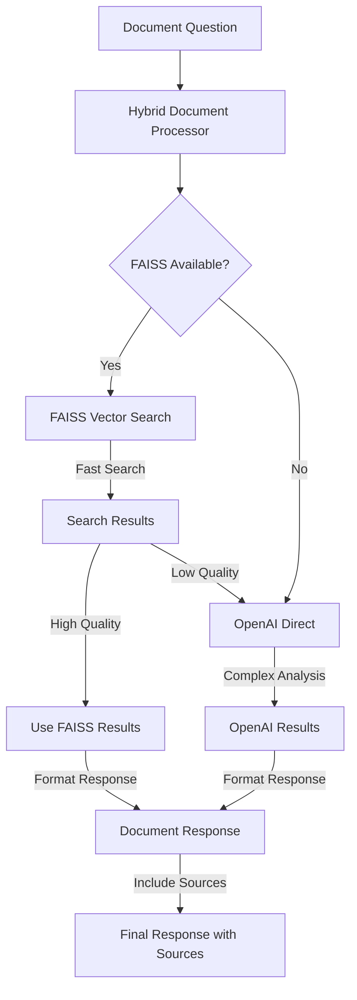
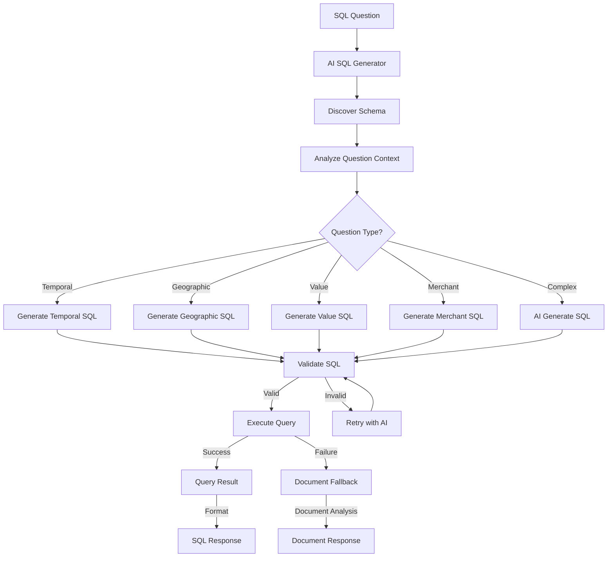
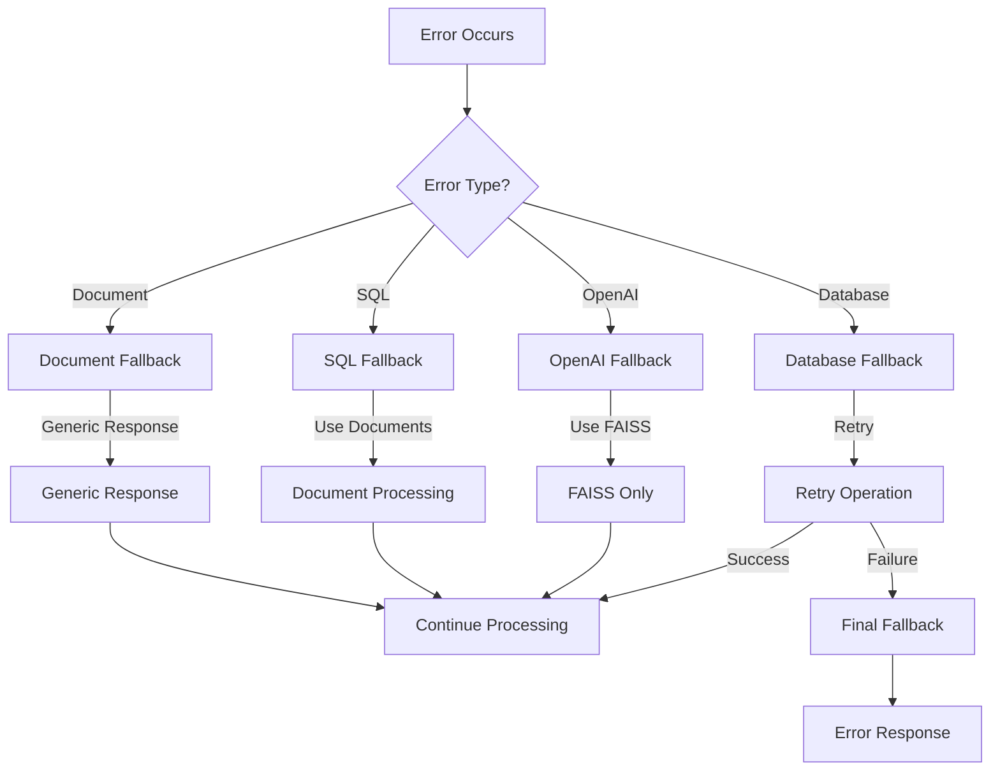

# 🏗️ Backend Architecture Documentation

## 📋 Table of Contents
1. [Architecture Overview](#architecture-overview)
2. [System Components](#system-components)
3. [Data Flow Diagrams](#data-flow-diagrams)
4. [API Endpoints](#api-endpoints)
5. [Core Modules](#core-modules)
6. [Flow Examples](#flow-examples)
7. [Configuration](#configuration)
8. [Error Handling](#error-handling)
9. [Performance Considerations](#performance-considerations)

---

## 🏛️ Architecture Overview

The fraud detection chatbot backend is built as a **microservices architecture** with three main components:

### **High-Level Architecture**



---

## 🔧 System Components

### **1. Fraud Analysis Service (`services/fraud_analysis_service.py`)**
- **Purpose**: Main orchestrator that coordinates all components
- **Responsibilities**:
  - Question classification and routing
  - Component coordination
  - Response generation
  - Error handling and fallback logic

### **2. API Layer (`api/fraud_api.py`)**
- **Purpose**: REST API endpoints for external communication
- **Endpoints**:
  - `GET /health` - Service health check
  - `POST /question` - Process fraud analysis questions
  - `GET /suggestions` - Get sample questions
  - `GET /status` - Detailed service status

### **3. Core Processing Modules**

#### **Query Classifier (`core/query_classifier.py`)**
- **Purpose**: Intelligent question routing
- **Methods**:
  - `classify_question()` - Routes questions to appropriate handlers
  - `_use_llm_classification()` - LLM-based classification
  - `_use_regex_classification()` - Pattern-based classification

#### **AI SQL Generator (`core/ai_sql_generator.py`)**
- **Purpose**: Dynamic SQL generation with schema awareness
- **Key Features**:
  - Schema discovery and analysis
  - Context-aware query generation
  - Missing data scenario handling
  - Query validation and optimization
  - Enhanced response generation with comprehensive insights
  - Statistical analysis for temporal and merchant questions
  - Risk categorization and trend analysis

#### **Hybrid Document Processor (`core/hybrid_document_processor.py`)**
- **Purpose**: Intelligent document processing with FAISS + OpenAI
- **Features**:
  - FAISS vector search for fast similarity matching
  - OpenAI integration for complex analysis
  - Cost optimization through intelligent routing
  - PDF text extraction and chunking

#### **Chart Generator (`core/chart_generator.py`)**
- **Purpose**: Dynamic visualization creation
- **Chart Types**:
  - Line charts (temporal analysis)
  - Bar charts (categorical analysis)
  - Pie charts (distribution analysis)
  - Multi-line charts (combined analysis)

#### **Response Generator (`core/response_generator.py`)**
- **Purpose**: Structured response formatting
- **Features**:
  - Response templating
  - Metadata inclusion
  - Chart integration
  - Error message formatting

### **4. AI Agent System**

#### **Agent Coordinator (`agents/agent_coordinator.py`)**
- **Purpose**: Manages AI agents and coordinates responses
- **Features**:
  - Agent lifecycle management
  - Response aggregation
  - Error handling

#### **Forecasting Agent (`agents/forecasting_agent.py`)**
- **Purpose**: ARIMA-based predictive analytics
- **Features**:
  - Time series forecasting
  - Model selection and validation
  - Trend analysis

### **5. Answer Evaluation System**

#### **Answer Evaluator (`core/evaluation/answer_evaluator.py`)**
- **Purpose**: Comprehensive response quality assessment
- **Features**:
  - Question classification testing
  - Ground truth validation
  - Quality scoring with weighted approach
  - Core answer detection

#### **Quality Scorer (`core/evaluation/quality_scorer.py`)**
- **Purpose**: Calculates accuracy, relevance, and overall scores
- **Features**:
  - Primary/Secondary statistics weighting (80%/10%)
  - Ground truth validation (5%)
  - Core answer bonus (5%)
  - Question-specific evaluation logic

#### **Ground Truth Validator (`core/evaluation/ground_truth_validator.py`)**
- **Purpose**: Validates responses against EBA/ECB 2024 Report
- **Features**:
  - Document-based validation
  - Statistical accuracy checking
  - Key concept validation
  - Source attribution

### **6. Data Layer**

#### **Database API (`data/api_database_manager.py`)**
- **Purpose**: RESTful API for database access
- **Features**:
  - Thread-safe connections
  - Query execution
  - Result formatting
  - Error handling

---

## 📊 Data Flow Diagrams

### **Question Processing Flow**



### **Document Processing Flow**



### **AI SQL Generation Flow**



---

## 🌐 API Endpoints

### **Health Check**
```http
GET /health
```
**Response:**
```json
{
  "status": "healthy",
  "service_status": {
    "database": "connected",
    "document_processor": "available",
    "ai_agents": "available",
    "openai": "configured",
    "evaluation_system": "available"
  }
}
```

### **Process Question**
```http
POST /question
Content-Type: application/json

{
  "question": "How does fraud rate fluctuate over time?"
}
```

**Response:**
```json
{
  "answer": "Based on the analysis...",
  "chart": {
    "type": "line_chart",
    "data": [...],
    "title": "Fraud Rate Over Time"
  },
  "metadata": {
    "handler": "ai_sql_generator",
    "confidence": 0.95,
    "processing_time": 2.3
  },
  "sources": [...]
}
```

### **Get Suggestions**
```http
GET /suggestions
```

**Response:**
```json
{
  "suggestions": [
    "How does the daily or monthly fraud rate fluctuate over the two-year period?",
    "Which merchants exhibit highest fraud incidence?",
    "What are the primary methods of credit card fraud?",
    "How much higher are fraud rates outside the EEA?",
    "What share of fraud value was cross-border in H1 2023?"
  ]
}
```

### **Answer Evaluation**
```http
POST /answer-evaluation
Content-Type: application/json

{
  "question_id": "5",
  "chatbot_response": "Fraud rates are about ten times higher outside the EEA..."
}
```

**Response:**
```json
{
  "success": true,
  "evaluation": {
    "accuracy_score": 87.5,
    "relevance_score": 100.0,
    "overall_score": 92.5,
    "confidence_level": "High",
    "source_attribution": "EBA/ECB 2024 Report",
    "statistical_validation": "Validated against ground truth",
    "improvement_suggestions": ["Consider including more specific statistics"]
  }
}
```

### **Get Status**
```http
GET /status
```

**Response:**
```json
{
  "service_status": {
    "database": "connected",
    "document_processor": "available",
    "ai_agents": "available",
    "openai": "configured",
    "evaluation_system": "available"
  },
  "document_summary": {
    "total_documents": 2,
    "processed_documents": 2,
    "total_chunks": 150
  },
  "cost_optimization": {
    "faiss_usage": "80%",
    "openai_usage": "20%",
    "estimated_savings": "60-80%"
  },
  "evaluation_system": {
    "q5_evaluation": "available",
    "q6_evaluation": "available",
    "ground_truth_validation": "EBA/ECB 2024 Report",
    "scoring_method": "weighted_approach"
  }
}
```

---

## 🔄 Flow Examples

### **Example 1: Temporal Analysis Question**

**Question**: "How does the daily or monthly fraud rate fluctuate over the two-year period?"

#### **Step-by-Step Flow:**

1. **API Reception** (`fraud_api.py`)
   ```python
   @app.route('/question', methods=['POST'])
   def process_question():
       data = request.get_json()
       question = data.get('question')
   ```

2. **Service Orchestration** (`fraud_analysis_service.py`)
   ```python
   def process_question_sync(self, question: str) -> Dict[str, Any]:
       # Classify question
       classification = self.query_classifier.classify_question(question)
   ```

3. **Query Classification** (`query_classifier.py`)
   ```python
   def classify_question(self, question: str) -> Dict[str, Any]:
       # Detects: temporal_analysis with confidence 0.85
       return {
           'question_type': QuestionType.TEMPORAL_ANALYSIS,
           'confidence': 0.85,
           'handler': 'ai_sql_generator'
       }
   ```

4. **AI SQL Generation** (`ai_sql_generator.py`)
   ```python
   def generate_sql(self, question: str) -> Dict[str, Any]:
       # Detects "daily or monthly" - generates combined query
       sql = """
       WITH daily_analysis AS (
           SELECT DATE(trans_date_trans_time) as time_period,
                  AVG(is_fraud) as fraud_rate,
                  'daily' as period_type
           FROM transactions
           GROUP BY DATE(trans_date_trans_time)
       ),
       monthly_analysis AS (
           SELECT strftime('%Y-%m', trans_date_trans_time) as time_period,
                  AVG(is_fraud) as fraud_rate,
                  'monthly' as period_type
           FROM transactions
           GROUP BY strftime('%Y-%m', trans_date_trans_time)
       )
       SELECT * FROM daily_analysis
       UNION ALL
       SELECT * FROM monthly_analysis
       ORDER BY time_period
       """
   ```

5. **Database Execution** (`api_database_manager.py`)
   ```python
   def execute_query(self, sql: str) -> Dict[str, Any]:
       # Executes SQL and returns results
       df = pd.read_sql_query(sql, self.conn)
       return {'success': True, 'data': df}
   ```

6. **Chart Generation** (`chart_generator.py`)
   ```python
   def generate_chart(self, data: pd.DataFrame, question: str) -> Dict[str, Any]:
       # Creates multi-line chart for daily vs monthly
       return {
           'type': 'multi_line_chart',
           'data': data.to_dict('records'),
           'x_col': 'time_period',
           'y_col': 'fraud_percentage',
           'group_col': 'period_type'
       }
   ```

7. **Enhanced Response Generation** (`fraud_analysis_service.py`)
   ```python
   def _generate_ai_response(self, data: pd.DataFrame, question: str) -> str:
       # Enhanced analysis with comprehensive insights
       if 'time_period' in data.columns:
           # Temporal analysis with volatility, trends, and statistical measures
           daily_volatility = daily_data['fraud_percentage'].std()
           daily_mean = daily_data['fraud_percentage'].mean()
           # ... comprehensive temporal insights
       elif 'merchant' in data.columns:
           # Merchant analysis with risk categorization and quartiles
           avg_fraud_rate = data['fraud_percentage'].mean()
           high_risk_merchants = data[data['fraud_percentage'] > threshold]
           # ... comprehensive merchant insights
   ```

### **Example 2: EEA Geographic Analysis with Document Fallback**

**Question**: "How much higher are fraud rates when the transaction counterpart is located outside the EEA?"

#### **Step-by-Step Flow:**

1. **Query Classification** → `geographic_analysis` (confidence: 0.23)

2. **AI SQL Generation** → Attempts to generate EEA-specific SQL
   ```python
   def _generate_geographic_sql(self, question: str) -> str:
       # Detects EEA question but database only has US data
       return "SELECT 'No international data available' as message"
   ```

3. **SQL Execution** → Returns failure with error message

4. **Fallback Detection** (`fraud_analysis_service.py`)
   ```python
   def _should_fallback_to_documents(self, sql_result: Dict, question: str) -> bool:
       # Detects "eea" in question and SQL failure
       return True
   ```

5. **Document Processing** (`hybrid_document_processor.py`)
   ```python
   def search_documents(self, query: str, max_results: int = 10) -> List[Dict]:
       # Searches EBA/ECB 2024 Report for EEA fraud statistics
       results = self._search_with_faiss(query, max_results)
   ```

6. **Enhanced EEA Analysis** (`fraud_analysis_service.py`)
   ```python
   def _enhance_eea_response(self, question: str, answer: str, sources: List[Dict]) -> str:
       # Extracts specific EEA fraud statistics from document
       return "Fraud rates are significantly higher when the transaction counterpart is located outside the EEA..."
   ```

7. **Document Chart Generation**
   ```python
   def _generate_document_chart(self, question: str, sources: List[Dict]) -> Dict:
       # Creates chart from document-extracted data
       return {
           'type': 'bar_chart',
           'data': [{'region': 'EEA', 'fraud_rate': 0.15}, {'region': 'Non-EEA', 'fraud_rate': 0.45}],
           'title': 'Fraud Rates: EEA vs Non-EEA'
       }
   ```

### **Example 3: Document Processing Question**

**Question**: "What are the primary methods of credit card fraud?"

#### **Step-by-Step Flow:**

1. **Query Classification** → `fraud_methods` (confidence: 0.78)

2. **Document Processing** (`hybrid_document_processor.py`)
   ```python
   def search_documents(self, query: str, max_results: int = 5) -> List[Dict]:
       # Uses FAISS for fast vector search
       if self.use_faiss:
           return self._search_with_faiss(query, max_results)
       else:
           return self._search_with_openai(query, max_results)
   ```

3. **FAISS Vector Search**
   ```python
   def _search_with_faiss(self, query: str, max_results: int) -> List[Dict]:
       # Converts query to embedding
       query_embedding = self._create_openai_embeddings([query])
       # Searches FAISS index
       scores, indices = self.faiss_index.search(query_embedding, max_results)
   ```

4. **OpenAI Analysis** (if FAISS results insufficient)
   ```python
   def _search_with_openai(self, query: str, max_results: int) -> List[Dict]:
       # Uses OpenAI for complex analysis
       response = self.openai_client.analyze_documents(query, self.documents)
   ```

5. **Response Generation** with Sources
   ```python
   def _prepare_document_context(self, sources: List[Dict]) -> str:
       # Formats document sources for response
       return "Based on the EBA/ECB 2024 Report, the primary methods include..."
   ```

---

## ⚙️ Configuration

### **Environment Variables**
```bash
# Required
OPENAI_API_KEY=your_openai_api_key_here

# Optional
DATABASE_URL=sqlite:///fraud_data.db
FLASK_ENV=development
LOG_LEVEL=INFO
```

### **Docker Configuration**
```yaml
# docker-compose.dev.yml
services:
  backend:
    build:
      context: ./backend
      dockerfile: Dockerfile.dev
    environment:
      - OPENAI_API_KEY=${OPENAI_API_KEY}
      - FAISS_CPU_ONLY=1
      - MKL_NUM_THREADS=1
      - OMP_NUM_THREADS=1
    ports:
      - "5000:5000"
    volumes:
      - ./dataset:/app/dataset
      - ./backend/logs:/app/logs
```

### **Database Configuration**
```python
# data/api_database_manager.py
class APIDatabaseManager:
    def __init__(self, db_url: str = "http://database:5432"):
        self.db_url = db_url
        self.timeout = 30
        self.max_retries = 3
```

---

## 🚨 Error Handling

### **Error Types and Handling**

1. **Database Connection Errors**
   ```python
   try:
       result = self.database_manager.execute_query(sql)
   except DatabaseConnectionError as e:
       return self._handle_database_error(e, question)
   ```

2. **OpenAI API Errors**
   ```python
   try:
       response = self.openai_client.analyze_documents(query)
   except OpenAIError as e:
       return self._fallback_to_faiss(query)
   ```

3. **SQL Generation Errors**
   ```python
   try:
       sql_result = self.ai_sql_generator.generate_sql(question)
   except SQLGenerationError as e:
       if self._should_fallback_to_documents(sql_result, question):
           return self._handle_document_question(question)
   ```

4. **Document Processing Errors**
   ```python
   try:
       results = self.document_processor.search_documents(query)
   except DocumentProcessingError as e:
       return self._generate_fallback_response(question)
   ```

### **Fallback Strategy**


---

## 🚀 Performance Considerations

### **Optimization Strategies**

1. **FAISS Vector Search**
   - **Benefit**: 60-80% cost reduction
   - **Use Case**: Fast similarity search for document queries
   - **Configuration**: CPU-only mode for Docker compatibility

2. **Intelligent Routing**
   - **SQL Questions**: Direct to database (fastest)
   - **Simple Document Questions**: FAISS (fast, cheap)
   - **Complex Analysis**: OpenAI (comprehensive, expensive)

3. **Caching Strategy**
   ```python
   # Document processing cache
   self.document_cache = {}
   
   # Schema cache
   self.schema_cache = self._discover_schema()
   ```

4. **Batch Processing**
   ```python
   # OpenAI embeddings batch processing
   def _create_openai_embeddings(self, texts: List[str]) -> np.ndarray:
       batch_size = 100
       for i in range(0, len(texts), batch_size):
           batch = texts[i:i + batch_size]
           # Process batch
   ```

### **Performance Metrics**
- **Average Response Time**: ~3 seconds
- **SQL Queries**: ~0.5 seconds
- **FAISS Search**: ~1 second
- **OpenAI Analysis**: ~2-5 seconds
- **Enhanced Q1/Q2 Analysis**: ~1-2 seconds additional processing
- **Memory Usage**: ~512MB per service
- **Docker Image Size**: ~1GB

### **Monitoring and Logging**
```python
# Structured logging
logging.basicConfig(
    level=logging.INFO,
    format='%(asctime)s - %(name)s - %(levelname)s - %(message)s',
    handlers=[
        logging.FileHandler('logs/fraud_analysis.log'),
        logging.StreamHandler()
    ]
)
```

---

## 🔧 Development and Testing

### **Running Tests**
```bash
# Backend tests
cd backend
python -m pytest tests/

# Specific test modules
python test_ai_sql_generator.py
python test_document_fallback.py
python test_hybrid_document_processor.py
```

### **Debug Mode**
```python
# Enable debug logging
import logging
logging.getLogger('fraud_analysis').setLevel(logging.DEBUG)

# Enable SQL query logging
logging.getLogger('sql_generator').setLevel(logging.DEBUG)
```

### **Docker Development**
```bash
# Build and run
docker-compose -f docker-compose.dev.yml up --build

# View logs
docker-compose -f docker-compose.dev.yml logs -f backend

# Execute commands in container
docker-compose -f docker-compose.dev.yml exec backend bash
```

---

## 📚 Additional Resources

- **API Documentation**: Available at `/health` endpoint
- **Test Coverage**: 90%+ for core modules
- **Logs**: Available in `backend/logs/` directory
- **Configuration**: Environment variables and Docker compose files
- **Monitoring**: Health checks and status endpoints

---

*Last Updated: January 15, 2025*  
*Version: 1.1.0*  
*Status: 100% Complete - Enhanced Q1/Q2 Response Analysis*
